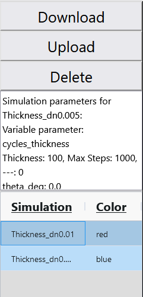

# Hologram App

This app simulates the **diffraction efficiency** of a **volume hologram** using **Rigorous Coupled-Wave Analysis (RCWA)**. It is specifically designed for **dependency analysis**, such as variations in **angle, wavelength, and thickness**.

The simulation includes the **hologram recording process** for **transmission** and **reflection holograms**.
A **graphical user interface (GUI)** allows users to analyze results, modify hologram parameters, and set variables for dependency studies.
Simulation results can be **stored for comparison**, as well as **downloaded and uploaded** for later investigations.


For more information about volume holograms and their recording process, see [Volume Holography](https://www.intechopen.com/chapters/53618).  
To learn more about Computational Methods and RCWA, check out this great tutorial at [empossible.net](https://empossible.net/academics/emp4301_5301/).

## Functional principle

The hologram is represented as a 2D layer in vacuum with a sinusoidally modulated refractive index, where an incident beam is diffracted.
The modulation is created by two recording beams with wave vectors $\vec{k}_1$ and $\vec{k}_2$, which interfere inside the hologram material, generating an intensity pattern.
This pattern modulates the refractive index according to the equation: 

$$n = n_0 + \Delta n \cdot cos(\vec K\cdot \vec r)$$

where:
+ $n_0$ is the average refractive index,
+ $\Delta n$ is the modulation depth,
+ $\vec{K}$ is the grating vector, calculated as:

 
$$\vec K = \vec k_1 - \vec k_2.$$


## Installation
The app is written in *Python* and can be started by running `app.py`.
All required packages are listed in `requirements.txt`. The app should work with most versions of the listed packages.

For a fully tested setup, the exact working package versions are listed in `requirements_version.txt`. The app has been tested with Python *3.11.7*.  

Once started, open your browser and go to [http://127.0.0.1:8050](http://127.0.0.1:8050) to access the application.


### Virtual Environment Setup (Windows)
You can create a virtual environment and install dependencies using the provided scripts:

* Ensure that Python is installed and the system path is set.
* Run create_venv.bat (or create_venv_version.bat for exact package versions).
* Start the app with run_hologram_app.bat.
* Open your browser and go to [http://127.0.0.1:8050](http://127.0.0.1:8050)

## Thickness calculation
In the simulation, the hologram is divided into $n_z$ layers along the z-direction. There are two available modes:

* **Thickness Mode:**
  + The entire hologram is divided into $n_z$ layers.
* **Cycle Mode:**
  + Only a single period in the z-direction is divided, where the period length is given by:  
    $l_z=2\pi/K_z$


Since the *hologram is periodic*, this method *optimizes calculations* and significantly *increases efficiency* when using RCWA.
The *\"cycles_thickness\" mode* in the app leverages this method for fast thickness investigations.

## Usage of the app
To use the app, first set the simulation parameters on the right side of the GUI.

### Selecting a Variable Parameter
At the top, you can define which *variable* should be analyzed for dependencies:


The parameter will be varied between **[start, end]** with equal step sizes.
You can also select *\"cycles_thickness\"* for thickness-dependent simulations.

```
Note
- All angles are in degrees. 
- All lengths are normalized. 

The normalization must be consistent across all parameters.

```


### Simulation Parameter

| Parameter | Description |
| -------- | -------- |
| theta | Polar angle of the incident beam |
| phi	| Azimuthal angle of the incident beam |
| lam |	Wavelength of the incident beam|
| theta_rec1/2 | Polar angle of the recording beams 1 and 2. For transmission holograms use for both beams: $-180°<\theta<180°$. For reflection holograms use for one beam: $180°<\theta<360°$ |
| phi_rec1/2 |	Azimuthal angle of the recording beams 1 and 2 |
| lam_hoe	| Wavelength of the recording beams |
| n0 |	Average refractive index |
| dn |	Modulation depth of the refractive index |
| thickness |	Thickness of the hologram |
| add_ar_layer	| Add an anti-reflection layer on both sides of the hologram |
| n_z |	Number of layers in the z-direction |
| nz_steps_per_cycle |	Enable cycle mode for thickness calculations |
| harmonic_order	| Number of harmonics used in the simulation (Total harmonics = 2 × order + 1) |

### **Control Section**  

The **control section** is located in the **lower middle part** of the GUI.  

  

This section allows you to **start and stop simulations**. A **progress indicator** displays the current progress of the simulation.  

Using the **checkboxes**, you can select which properties of the simulation should be displayed. The following options are available:  
- **Transmission** and **reflection** for **S- and P-polarization**  
- The **order number** of the property, adjustable via a numerical control  

Additionally, you can **display the total energy** for **S- and P-polarization**, which helps verify **energy conservation**.  

#### **Saving Simulations**  
Simulations can be saved in the **store**:  
1. **Choose a unique name**  
2. **Press the "Save" button**  

⚠️ **Warning:** If a simulation with the same name already exists, it will be **overwritten without warning**.  

---

### **Store Section**  

The **store section** is located on the **left side** of the GUI.  

  

#### **Managing Simulations**  
- **Saved simulations** are displayed in the **lower part** of the section.  
- **Selecting a simulation** will display it in the graph. **Multiple selections** are possible.  
- The **color column** is **editable**, allowing you to change the color of the simulation curves.  

#### **Simulation Information**  
The **middle section** contains a **text field** that displays information about the **first selected simulation**.  

#### **Simulation Management**  
The **upper part** of the store section contains buttons to:  
- **Download** saved simulations  
- **Upload** saved simulations  
- **Delete** selected simulations  

⚠️ **Warning:** **Deleting a simulation** will **permanently remove all selected simulations**.  

